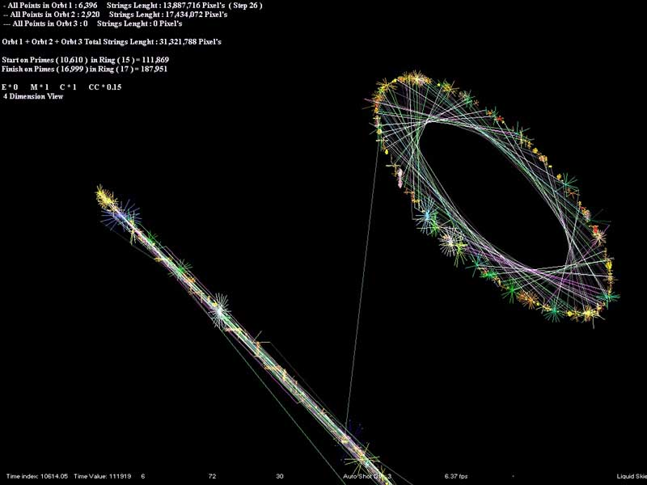



## Time Engine 7\.7 \( Beta 1\)

### Description

4 Dimention Distance Calculator .

All of The Natures Make with Prime Numbers Values And Rings.

Prime Numbers are everything.

All The Universe Set With Prime Numbers Algoritm.
 
### More Info
 

             |
---                |---
**Submitted On**   |2010-06-30 23:48:00
**By**             |[Kaveh Abdollahi](https://github.com/Planet-Source-Code/PSCIndex/blob/master/ByAuthor/kaveh-abdollahi.md)
**Level**          |Advanced
**User Rating**    |5.0 (10 globes from 2 users)
**Compatibility**  |VB 5\.0, VB 6\.0
**Category**       |[Complete Applications](https://github.com/Planet-Source-Code/PSCIndex/blob/master/ByCategory/complete-applications__1-27.md)
**World**          |[Visual Basic](https://github.com/Planet-Source-Code/PSCIndex/blob/master/ByWorld/visual-basic.md)
**Archive File**   |[Time\_Engin218396712010\.zip](https://github.com/Planet-Source-Code/kaveh-abdollahi-time-engine-7-7-beta-1__1-73207/archive/master.zip)

